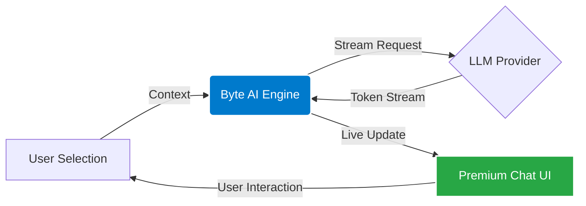

  
  <h1>Byte Coder AI Agent</h1>
  

    <b>The Ultimate Premium AI Coding Companion for VS Code</b>
  

  
  
  
  

 

> **Byte Coder** transforms your VS Code environment into an intelligent, AI-powered development studio. With a focus on **premium aesthetics** and **powerful autonomous capabilities**, it acts as your expert pair programmer, ready to explain, fix, refactor, and generating tests at the speed of thought.

---

## ✨ Why Byte Coder?

Byte Coder isn't just another AI extension. It's designed for developers who demand **elegance and efficiency**.

### 💎 Premium Design Philosophy
We believe dev tools should be beautiful.
- **Glassmorphism UI**: A stunning, translucent interface that feels native to modern OS aesthetics.
- **Typography First**: meticulously tuned font stacks using `Inter` and `JetBrains Mono` for superior readability.
- **Fluid Animations**: Every interaction is animated for a smooth, responsive feel.

### ⚡ Intelligent Capabilities
- **Deep Code Understanding**: Select any code snippet and ask complex questions.
- **One-Click Actions**: Explain, Fix, Refactor, and Test with dedicated, contextual commands.
- **Session Management**: Never lose context. Your chat history is saved and organized in a beautiful slide-out drawer.
- **Privacy Focused**: Your code stays yours. Usage is secure and direct.

---

## 🚀 Key Features

### 1. Smart Chat Interface
Interact with your codebase using natural language. The chat interface is aware of your current context, making it easy to ask about open files or specific functions.

### 2. Contextual Quick Actions
Right-click any selection in your editor to access powerful AI tools instantly:
- **🕵️ Explain Code**: Get a breakdown of complex logic in plain English.
- **🐛 Find Bugs**: detailed analysis of potential runtime errors or logical flaws.
- **🔨 Refactor**: Modernize legacy code or improve performance with one click.
- **🧪 Generate Tests**: Automatically create comprehensive unit tests (Jest, Mocha, PyTest, etc.).
- **📝 Generate Docs**: Auto-generate JSDoc/Docstrings for your functions.

### 3. History & Session Management
Keep your work organized.
- **Auto-Saving**: All conversations are saved locally.
- **Session Drawer**: Easily browse past discussions, grouped by date.
- **Search**: Find previous solutions instantly.

---

## 🧠 Architecture

Byte Coder leverages a streamlined architecture to bridge VS Code with advanced LLMs.

---

## 💻 Getting Started

1.  **Install**: Get extension from the VS Code Marketplace.
2.  **Open**: Click the  icon in your sidebar.
3.  **Chat**: Start typing or use the `/` command menu for quick actions.

---

## 🏢 Built by UTHAKKAN

**UTHAKKAN** is a forward-thinking technology studio dedicated to building the next generation of digital tools.

  <h3>👨‍💻 Ajmal U K</h3>
  
Full Stack Developer & Visionary

  

    <a href="https://github.com/ajmal-uk">GitHub</a> • 
    <a href="https://uthakkan.pythonanywhere.com">Website</a> • 
    <a href="mailto:contact.uthakkan@gmail.com">Contact</a>
  

---

  © 2025 UTHAKKAN. All rights reserved.

