#  Byte Coder - Agentic AI Coding Assistant

**The Ultimate Agentic AI for VS Code.**  
*Autonomous. Intelligent. Secure.*

**Byte Coder** is a **next-generation Agentic AI** that acts as your **Senior Pair Programmer**. It acts continuously, planning complex architectures, writing production-ready code, and ensuring safety at every step.

---

## 🚀 The Byte Coder Difference

### 🧠 9-Step Agent Pipeline
Unlike simple chatbots, Byte Coder uses a sophisticated multi-agent pipeline to process every request:

```mermaid
graph TD
    User[User Request] --> A[✨ Prompt Enhancer]
    A --> B{Intent Analyzer}
    B -->|Code| C[🏗️ Context Planner]
    B -->|Chat| H[Output Composer]
    C --> D[📖 File Reader]
    D --> E[🧠 Technical Reasoner]
    E --> F[✅ Evaluator]
    F --> G[🛡️ Safety Check]
    G -->|Safe| I[⚡ Generator Agent]
    G -->|Unsafe| Block[🛑 Blocked]
    I --> H[Output Composer]
```

### 🛡️ Shadow VCS (Time Travel)
Byte Coder includes a **hidden, isolated Version Control System** (`.byteai/shadow_vcs`).
- **Zero Pollution**: Your main git history remains untouched.
- **Undo Everything**: Click the "Undo" button to revert agent actions instantly.
- **Time Travel**: Reset any chat message to revert your *entire project* to exactly how it was at that moment.

### ⚡ True Agentic Capabilities
- **Planner Agent**: Defaults to "Consultant Mode" to plan architectures before coding.
- **Safety Evaluator**: Automatically blocks destructive commands like `rm -rf`.
- **Smart Context**: Reads your codebase intelligently, chunking large files to fit token limits.

---

## 💡 Usage Guide

### Starting the AI
1.  **Open Chat**: Click the Byte AI icon in the sidebar.
2.  **Ask**: "Create a React component for a login form."
3.  **Plan & Execute**:
    - The agent will first **Plan** the solution.
    - Review the `implementation_plan.md`.
    - Type "Proceed" or click "Execute" to let the agent write the code.

### Commands
| Command | Description |
| :--- | :--- |
| `/plan` | Generate a detailed architectural plan. |
| `/fix` | Analyze and fix bugs in selected code. |
| `/test` | Generate unit tests. |
| `/explain` | Explain complex logic. |

---

## 🏢 About UTHAKKAN

**UTHAKKAN** is a independent technology studio founded by **Ajmal U K**.

> *"Building the Future of Digital Experiences"* — [uthakkan.pythonanywhere.com](https://uthakkan.pythonanywhere.com)

### 👨‍💻 Founder
**Ajmal U K** (Full Stack Developer & MCA Scholar)
- **GitHub**: [ajmal-uk](https://github.com/ajmal-uk)
- **Contact**: [contact.uthakkan@gmail.com](mailto:contact.uthakkan@gmail.com)

---

  © 2025 UTHAKKAN. Made with ❤️ in India.

